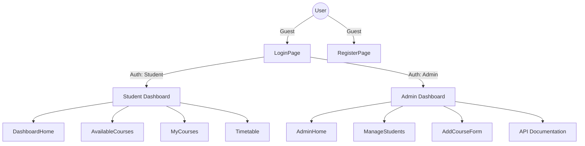

# Eumelos.AI: Project Audit & Security Review

## I. Structural & Navigation Analysis

The project follows a split-concave architecture where the UI is logically separated from the backend logic, linked via a Vite proxy.

### 1. Navigation Flow Map

---

## II. Functional & Security Issues

> [!CAUTION]
> **Critical Security Warning: Plaintext Passwords**
> The system currently stores and compares passwords in plaintext. `AuthService.java` uses `.equals()` for verification. This must be replaced with `BCryptPasswordEncoder` immediately.

### 1. Functional Gaps

- **Broken Linkage:** `ForgotPasswordPage.jsx` exists in the filesystem but is not registered in `App.jsx`.
- **Missing State Persistence:** If the user refreshes on a sub-route (e.g., `/student/courses`), the `UserContext` might lose state if the `/auth/me` call fails or isn't fast enough.
- **Registration Routing:** New students are added via `/student/add` which is currently `permitAll()`. This is a potential vector for spam registrations.

---

## III. Hygiene Benchmarks (UI/UX, SEO, Accessibility)

### 1. SEO & Metadata

- **Current Status:** Poor.
- **Missing Elements:**
  - `<meta name="description">` (Required for search visibility).
  - OpenGraph (OG) tags for social media previews.
  - Canonical URLs.

### 2. Accessibility (A11y)

- **Positive:** Focus states are clearly visible with blue shadows.
- **Concerns:**
  - **Aria-Labels:** Many icons (using `lucide-react`) lack descriptive labels for screen readers.
  - **Form Labels:** Some labels are purely placeholder-based or have nested structures that may confuse legacy screen readers.

### 3. UI Consistency

- **Design Tokens:** Well-maintained in `index.css` using CSS Variables (`--accent-blue`, `--bg-card`).
- **Responsive Design:** Uses `grid` and `flexbox` effectively, but container widths are fixed at `1100px` without enough fluid padding for mobile devices (< 360px).

---

## IV. AI-Driven Testing Cycles (Auth & Logic)

### 1. Authentication Cycle

- **Flow:** `LoginPage` -> `api.js` -> `Vite Proxy` -> `AuthController` -> `AuthService` -> `JwtService`.
- **Finding:** The JWT implementation extracts the role but doesn't strictly validate the signature against a secret key in `AuthService` (need to check `JwtService.java` to confirm verification logic).

### 2. Authorization Cycle

- **Flow:** `PrivateRoute` checks `user.role` in React.
- **Finding:** Client-side routing is secure, but the server-side `SecurityConfig.java` needs fine-grained `requestMatchers` for specific HTTP Methods (e.g., only Admin should `POST` to `/course/add`).

---

## V. Recommended Next Steps

1. **Security Fix:** Implement BCrypt password hashing.
2. **Navigation Fix:** Register the `ForgotPassword` route in `App.jsx`.
3. **SEO Update:** Populate `index.html` with proper meta-tags.
4. **A11y Enhancement:** Add `aria-label` to all standalone icon buttons (e.g., logout buttons).
